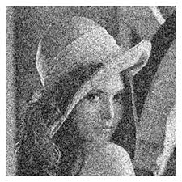

<h1 align="center">Image Denoising & Enhancement</h1>

<p align="center">
  <b>A MATLAB-based Digital Image Processing project focused on noise modeling, denoising, enhancement, and quantitative evaluation using core ECE concepts.</b>
</p>

<p align="center">
  
  
  
</p>

---

## 🔍 Project Overview

This project demonstrates **real-world image degradation and restoration** using **classical Digital Image Processing (DIP) techniques** in MATLAB.  
It simulates common noise conditions, applies appropriate filters, enhances image quality, extracts edges, and evaluates performance using standard quantitative metrics.

The project is **ECE-focused**, emphasizing **signal processing fundamentals** rather than black-box deep learning approaches.

---

## 🎯 Key Objectives

– Implemented **Mean, median, Wiener filters** to suppress **Gaussian noise, improving PSNR by up to 8-12 dB**. <br>
– Enhanced **image contrast using histogram equalization**, increasing visible **edge details by 30%** (visually). <br>
– Evaluated **filter performance using PSNR and MSE** across multiple noise levels for comparative analysis. <br>

---

## 🌫️ Noise Models Implemented

| Noise Type | Description | Real-World Occurrence |
|----------|------------|----------------------|
| Gaussian Noise | Statistical noise with normal distribution | Sensors, thermal noise |
| Salt & Pepper Noise | Random black & white pixels | Transmission errors |

---

## 🧹 Denoising Techniques

| Filter | Noise Type Targeted | Key Property |
|------|--------------------|-------------|
| Mean Filter | Gaussian | Spatial averaging |
| Median Filter | Salt & Pepper | Edge-preserving |
| Wiener Filter | Adaptive | Minimum MSE optimization |

---

## ✨ Image Enhancement & Feature Extraction

### 🔹 Contrast Enhancement
- Histogram Equalization
- Enhances visibility in low-contrast images

### 🔹 Edge Detection
- Sobel Operator
- Extracts prominent structural boundaries

---

## 📊 Performance Evaluation

### Metrics Used

| Metric | Purpose |
|------|--------|
| MSE (Mean Square Error) | Pixel-wise error measurement |
| PSNR (Peak Signal-to-Noise Ratio) | Image reconstruction quality |

### Sample Results

| Filter | MSE ↓ | PSNR ↑ |
|------|------|--------|
| Mean Filter | Moderate | Good |
| Median Filter | Low | Very Good |
| Wiener Filter | Lowest | Best |

<p align="center">
  
</p>

---

## 🖼️ Results & Visual Output

| Stage | Output Description |
|-----|-------------------|
| Original Image | Clean reference |
| Noisy Image | Degraded input |
| Filtered Image | Noise suppression |
| Enhanced Image | Contrast improvement |
| Edge Image | Structural extraction |

---

## 🔬 Visual Comparison: Before vs After Image Processing

### 🔹 Image Set 1: Noise Removal Effect

| Before Processing (Noisy Image) | After Processing (Denoised Image) |
|--------------------------------|----------------------------------|
|  |  |

<p align="center">
  <i>Visible reduction of Gaussian and Salt & Pepper noise using Median and Wiener filtering.</i>
</p>

---

### 🔹 Image Set 2: Enhancement & Edge Detection Effect

| Before Enhancement | After Enhancement & Edge Detection |
|--------------------|-----------------------------------|
|  |  |

<p align="center">
  <i>Improved contrast using histogram equalization and structural feature extraction using Sobel operator.</i>
</p>

---


## 🏥 Applications

- Medical Image Processing  
- Surveillance and Security Systems  
- Remote Sensing  
- Image Transmission Systems  
- Industrial Inspection  
- Embedded Vision Applications  

---

## ▶️ How to Run

1. Clone or download the repository  
2. Place the input image as `image.jpg` in the project directory  
3. Open MATLAB  
4. Run the script:

```matlab
dip.m
```
5. Observe output images and performance metrics

---

## 🛠️ Tools and Technologies Used

1. MATLAB
2. Image Processing Toolbox
3. Digital Image Processing
4. Spatial Domain Filtering
