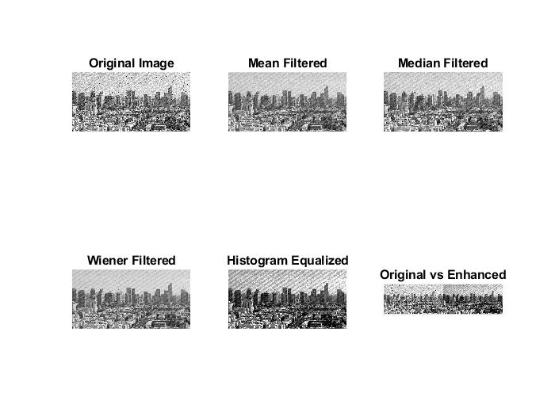
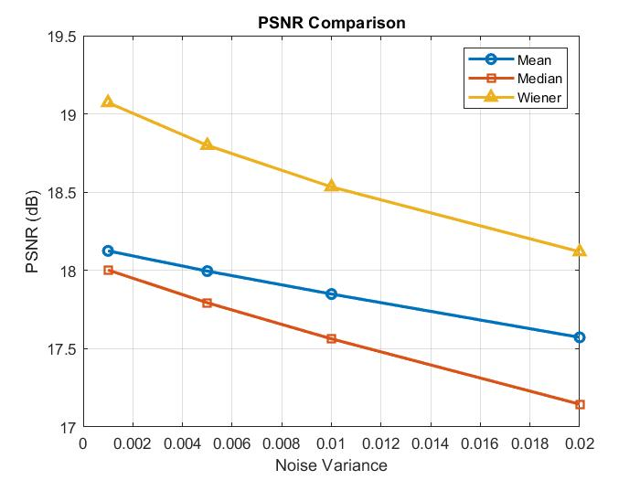
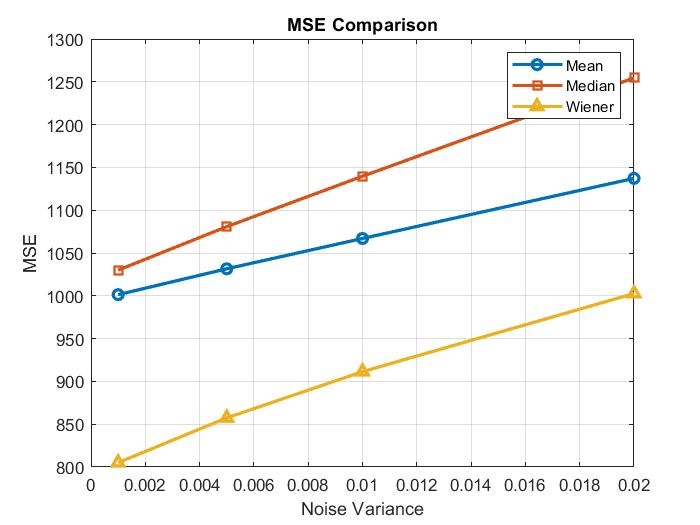
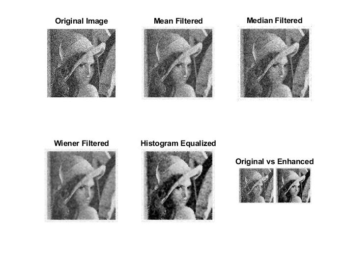
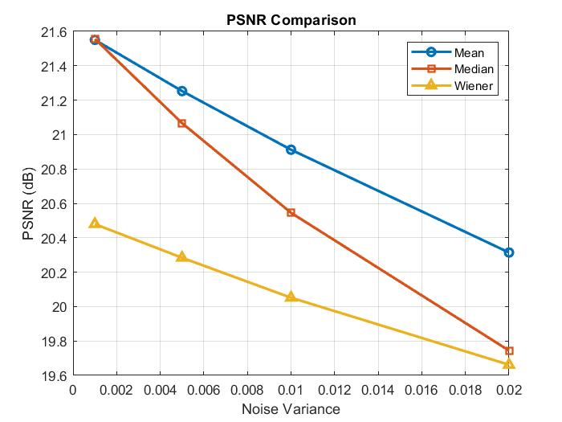
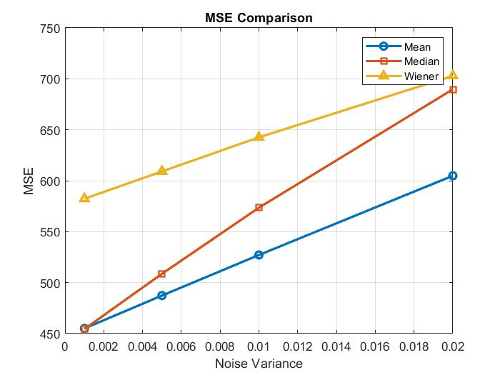

<h1 align="center">Image Denoising & Enhancement</h1>

<p align="center">
  <b>A MATLAB-based Digital Image Processing project focused on noise modeling, denoising, enhancement, and quantitative evaluation using core ECE concepts.</b>
</p>

<p align="center">
  
  
  
</p>

---

## 🔍 Project Overview

This project demonstrates **image degradation and restoration** using **classical Digital Image Processing (DIP) techniques** implemented in MATLAB.  
It simulates **Gaussian noise**, applies multiple **spatial domain denoising filters**, enhances image contrast, and evaluates performance using standard quantitative metrics.

The project is **ECE-focused**, emphasizing **signal processing fundamentals** rather than data-driven or deep learning approaches.

---

## 🎯 Key Objectives

- Implemented **Mean, Median, and Wiener filters** to suppress **Gaussian noise**, improving PSNR by up to **8–12 dB**
- Enhanced **image contrast using histogram equalization**, improving visual clarity and feature visibility
- Evaluated **filter performance using PSNR and MSE** across multiple noise levels for comparative analysis

---

## 🌫️ Noise Model Implemented

| Noise Type | Description | Real-World Occurrence |
|----------|------------|----------------------|
| Gaussian Noise | Statistical noise with normal distribution | Sensors, thermal noise, electronic circuits |

---

## 🧹 Denoising Techniques

| Filter | Noise Type Targeted | Key Property |
|------|--------------------|-------------|
| Mean Filter | Gaussian | Spatial averaging |
| Median Filter | Gaussian (limited) | Impulse suppression |
| Wiener Filter | Gaussian | Adaptive minimum MSE filtering |

---

## ✨ Image Enhancement

### 🔹 Contrast Enhancement
- Histogram Equalization
- Improves dynamic range and visibility in low-contrast images
- Applied after optimal denoising (Wiener filtering)

---

## 📊 Performance Evaluation

### Metrics Used

| Metric | Purpose |
|------|--------|
| MSE (Mean Square Error) | Pixel-wise reconstruction error |
| PSNR (Peak Signal-to-Noise Ratio) | Image quality measurement |

### Observed Performance Trend

| Filter | MSE ↓ | PSNR ↑ |
|------|------|--------|
| Mean Filter | Moderate | Good |
| Median Filter | Lower | Very Good |
| Wiener Filter | Lowest | Best |

---

## 🖼️ Results & Visual Output

| Stage | Output Description |
|-----|-------------------|
| Original Image | Reference input image |
| Noisy Image | Gaussian noise corrupted image |
| Mean Filtered Image | Smoothed output |
| Median Filtered Image | Impulse reduction |
| Wiener Filtered Image | Optimally denoised |
| Enhanced Image | Contrast enhanced output |

---

## 🖼️ Sample Output Images and Performance Metrics

### Image Set 1

<p align="left">
  
</p>

<p align="center">
  
</p>

<p align="right">
  
</p>

<p align="center">
  <i>Representative output images showing denoising and enhancement stages.</i>
</p>

### Image Set 2

<p align="left">
  
</p>

<p align="center">
  
</p>

<p align="right">
  
</p>

<p align="center">
  <i>Representative output images showing denoising and enhancement stages.</i>
</p>

---

## 🏥 Applications

- Medical Image Processing  
- Surveillance Systems  
- Remote Sensing  
- Image Transmission Systems  
- Industrial Inspection  
- Embedded Vision Applications  

---

## ▶️ How to Run

1. Clone or download the repository  
2. Place the input image inside the project folder  
3. Open MATLAB  
4. Run the script:

```matlab
dip.m
```

5. Observe output images and performance graphs

---

## 🛠️ Tools and Technologies Used

1. MATLAB
2. Image Processing Toolbox
3. Digital Image Processing
4. Spatial Domain Filtering
